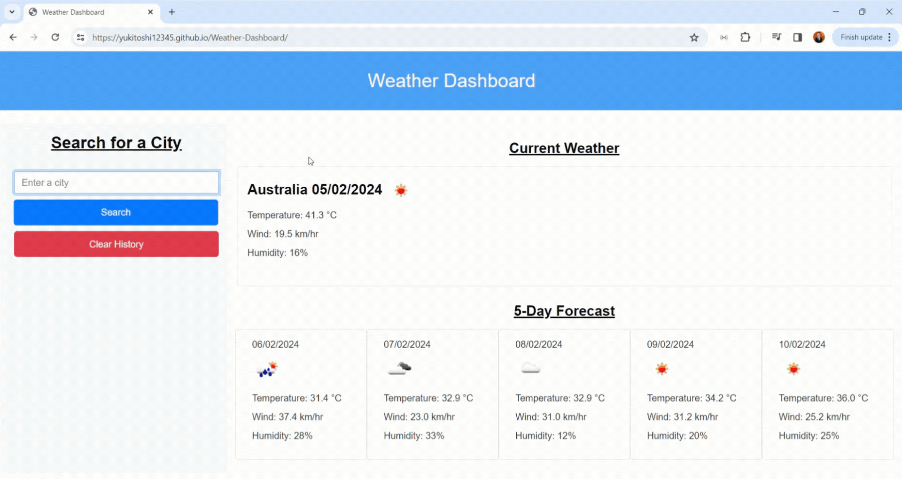

     

<h1 align = "center"> Weather Dashboard </h1>
Imagine planning your trip with the world's weather at your fingertips. This weather dashboard caters to the wanderlust in you, letting you effortlessly search for multiple cities and view their current and future conditions. Simply type in a city name, and presto! The current date, a weather icon, temperature, humidity, and wind speed appear, instantly painting a picture of the city's climate. Curious about the coming days? No problem! A 5-day forecast awaits, detailing the weather with icons, temperatures, wind speeds, and humidity levels. And to revisit past searches, a click on a city in the history brings back its complete weather picture. It's a world of weather information, all in one organised dashboard, empowering you to plan your trip with confidence and ease.

## Table of Contents

- [User Story](#user-story)
- [Acceptance Criteria](#acceptance-criteria)
- [Technologies Used](#technologies-used)
- [Screenshot](#screenshot)
- [Video](#video)
- [Output](#output)
- [Installation](#installation)
- [License](#license)


## User Story

```md
AS A traveller
I WANT to see the weather outlook for multiple cities
SO THAT I can plan a trip accordingly
```

## Acceptance Criteria
```
GIVEN a weather dashboard with form inputs
WHEN I search for a city
THEN I am presented with current and future conditions for that city and that city is added to the search history
WHEN I view current weather conditions for that city
THEN I am presented with the city name, the date, an icon representation of weather conditions, the temperature, the humidity, and the wind speed
WHEN I view future weather conditions for that city
THEN I am presented with a 5-day forecast that displays the date, an icon representation of weather conditions, the temperature, the wind speed, and the humidity
WHEN I click on a city in the search history
THEN I am again presented with current and future conditions for that city
```

## Technologies Used
- HTML
- CSS
- JavaScript
- Bootstrap 
- jQuery
- Day.js

## Screenshot


## Video


## Output
The Weather Dashboard functions as a user-friendly interface, presenting weather information for a chosen city. Upon searching for a city, the dashboard displays both current and upcoming weather conditions, while also adding the city to a search history for quick revisit. Viewing current conditions reveals details like city name, date, weather icon, temperature, humidity, and wind speed. Similarly, the future forecast section provides a 5-day outlook with the same set of details. Clicking a city in the search history recalls its current and future weather information. Finally, a dedicated button clears the entire search history for a fresh start. 

## Installation
The project was uploaded to [GitHub](https://github.com/) at the following repository:
[https://github.com/yukitoshi12345/Weather-Dashboard/](https://github.com/yukitoshi12345/Weather-Dashboard)

You can access the deployed application with the GitHub Pages link:
[https://yukitoshi12345.github.io/Weather-Dashboard/](https://yukitoshi12345.github.io/Weather-Dashboard/)

## License
This project is licensed under the [MIT License](https://github.com/Yukitoshi12345/Weather-Dashboard/blob/main/LICENSE).